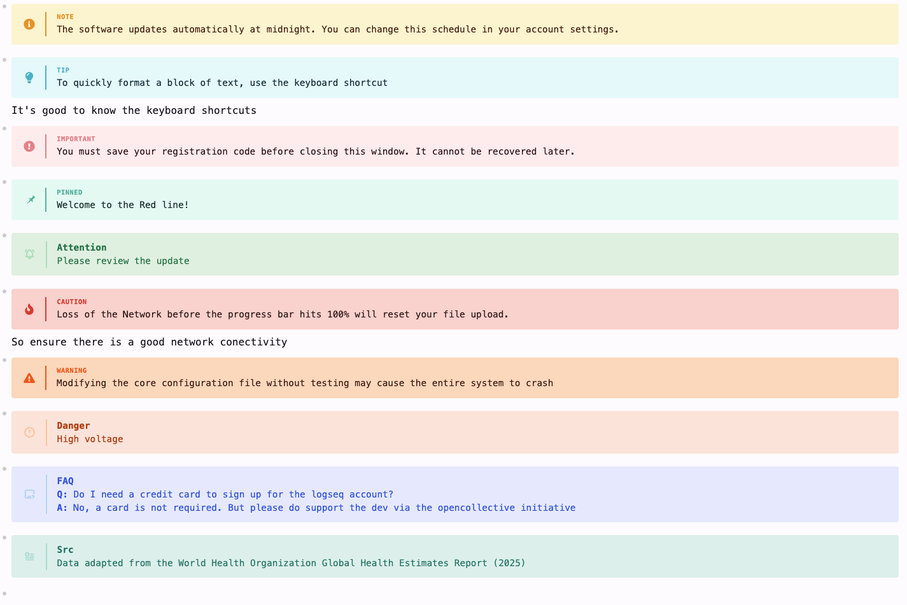

#+TITLE: Logseq Admonitions
#+OPTIONS: toc:nil

Tag-driven *native* admonitions for Logseq DB graphs.

You write a =#tag=; the plugin rewrites it, in place, into Logseq's native
=#+BEGIN_<TYPE> ... #+END_<TYPE>= admonition block — and ships the CSS that
themes those blocks. 

#+begin_quote
Tag-driven trigger, rendered through Logseq's *built-in* admonitions rather
than custom callout markup.
#+end_quote

* Preview

#+CAPTION: Native (Note/Tip/Important/Pinned/Caution/Warning) and non-native (Attention/Danger/FAQ/Src) admonitions.

* How it works

#+begin_example
#Tip                          #+BEGIN_TIP
Press Ctrl+K to search    →   Press Ctrl+K to search
                              #+END_TIP
#+end_example

Rules, scanning *downward* from the tag:

| You type                 | Becomes              | Notes                        |
|--------------------------+----------------------+------------------------------|
| =#tip= (opener tag)      | =#+BEGIN_TIP=        | the tag opens the admonition |
| =\end= (standalone line) | =#+END_TIP=          | optional explicit closer     |
| /(no =\end=)/            | =#+END_TIP= appended | runs to the end of the block |

- Content *above* the tag stays outside the admonition.
- Content *after* =\end= stays outside, as normal text.
- Once a block contains #+BEGIN_, future rewrites will leave it unchanged.

** Examples
No closer — everything below the tag falls in:

#+begin_example
- Daily standup notes
#Note
Remember to update the sprint board
Ping the team if you're blocked
#+end_example

Explicit =\end= — only the lines above the closer fall in:

#+begin_example
#Warning
Deleting a page cannot be undone
\end
Back up your graph regularly
#+end_example

* Supported tags

** Native (v1)

These rewrite straight into Logseq's native admonition blocks:

| Colored (themed by the CSS)                          | Native, uncolored          |
|------------------------------------------------------+----------------------------|
| =note= =tip= =pinned= =important= =warning= =caution= | =center= =example= =verse= |

** Non-native (v2)

Tags with no native admonition wrap into a semantically-close native *host* with
a visible =**Label**= marker, then get their own color + icon via a per-block CSS
overlay (so e.g. =#faq= is distinct from a plain =#note=):

| Tag         | Color  | Host      |
|-------------+--------+-----------|
| =faq=       | blue   | NOTE      |
| =danger=    | orange | WARNING   |
| =attention= | green  | IMPORTANT |
| =src=       | teal   | NOTE      |

Edit the =NON_NATIVE= table in =src/overlays.ts= to change a tag's color
(=COLOR_GROUPS= Radix tokens) or icon (a Tabler glyph code point), add tags, or
remove them. The host only matters structurally — the overlay fully recolors and
re-icons the box.

* Build

Builds with *Deno* (>= 2.4) — a single binary, no Node toolchain:

#+begin_src sh
deno install              # fetch @logseq/libs into node_modules
deno task build           # bundle -> dist/index.js
deno task test            # run the transform unit tests
deno check src/index.ts   # typecheck
#+end_src

* Install in Logseq

1. =deno task build= (produces =dist/index.js=; =dist/index.html= is committed).
2. Logseq -> *Plugins -> Load unpacked plugin* -> select this repo's folder.
3. The plugin injects its CSS automatically; no theme / =custom.css= step needed.

* Notes

- DB graphs only (=supportsDBOnly=).
- The block currently being edited is skipped, so your cursor is never yanked;
  the rewrite fires once you move off the block.

* Credits

The admonition styling is adapted from
[[https://gist.github.com/sourcebert/cbeb4799cc8f0925f23f8f76471da288][this gist]]
by sourcebert (=logseq-db-admonitions.css=).
